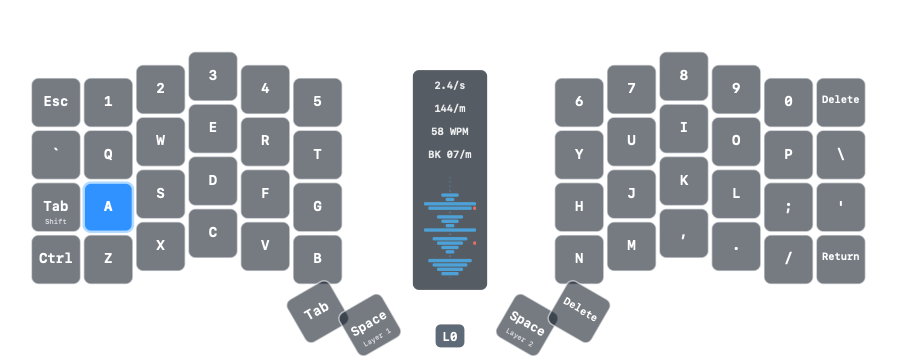

# Probe

Probe is a tiny native macOS HUD for the ZSA Voyager. It floats above your
desktop, listens to Raw HID telemetry from your keyboard, and renders a live
transparent keymap with pressed-key highlights, layer changes, heatmap history,
and typing metrics.



## Features

- Transparent, borderless floating AppKit HUD
- Live pressed-key highlighting and layer tracking from Voyager Raw HID
- Optional heatmap overlay with session and all-time counts
- Optional vertical typing stats: strokes per second, strokes per minute, WPM,
  and backspaces per minute
- First-launch keymap import prompt for `keymap.c`, `.qmk`, or a QMK/Oryx source
  ZIP
- Drag-and-drop keymap import onto the HUD
- Menu bar controls for visibility, locking/moving, opacity, scale, display
  toggles, heatmap resets, diagnostics, and quit
- XcodeGen project generation with reusable Swift Package core logic

Probe does not ship a personal keymap or firmware export. On first launch, import
your own Voyager keymap so the HUD can label keys correctly.

## Requirements

- macOS 14 or newer
- Xcode with Swift 6 support
- [XcodeGen](https://github.com/yonaskolb/XcodeGen)
- [Sparkle](https://sparkle-project.org/) is resolved by Swift Package Manager
- ZSA Voyager firmware that emits Probe-compatible 32-byte Raw HID telemetry

## Getting Started

Install XcodeGen if needed:

```sh
brew install xcodegen
```

Generate the Xcode project:

```sh
xcodegen generate
```

Open and run `Probe.xcodeproj`, or build from the command line:

```sh
xcodebuild -project Probe.xcodeproj -scheme Probe -configuration Debug -destination 'platform=macOS' build
```

On first launch, Probe asks you to drop or choose your Voyager `keymap.c`, `.qmk`,
or QMK/Oryx source ZIP. The imported keymap is stored locally in Application
Support.

## Firmware Notes

Probe listens for the Voyager Raw HID interface:

- Vendor ID: `0x3297`
- Product ID: `0x1977`
- Usage page: `0xFF60`
- Usage: `0x61`

On connect, Probe sends ZSA's Oryx live-view pairing-init command over that Raw
HID interface. Firmware built with ZSA's `oryx` community module will then stream
physical key positions and layer changes. If diagnostics show `Connected` plus
`Pairing requested; waiting for reports`, the Raw HID interface is open but the
keyboard has not replied with live-view events.

Keymapp or other tools may compete for the same Raw HID interface, so close them
while testing live telemetry.

## Project Layout

- `Apps/Probe`: AppKit menu bar app and HUD UI
- `Packages/ProbeCore`: reusable parsing, layout, telemetry, and heatmap logic
- `Scripts/lint-swift.sh`: Swift syntax lint used by the Xcode build
- `project.yml`: XcodeGen project definition
- `Docs/probe-hud.png`: README screenshot generated from the screenshot tests

`Probe.xcodeproj` is generated and intentionally ignored by git.

## Updates

Probe uses Sparkle 2 via Swift Package Manager. The project includes a default
appcast at `https://raw.githubusercontent.com/bogo/probe/main/appcast.xml` and a
`Check for Updates...` menu item.

Release builds need a Sparkle EdDSA key before update checks can run:

```sh
.derivedData/SourcePackages/artifacts/sparkle/Sparkle/bin/generate_keys
```

Keep the private key in your Keychain. Set the printed public key as
`SPARKLE_PUBLIC_ED_KEY` for release builds, then use Sparkle's `generate_appcast`
tool to update `appcast.xml` for signed release archives.

For example:

```sh
xcodebuild -project Probe.xcodeproj -scheme Probe -configuration Release SPARKLE_PUBLIC_ED_KEY="..."
```

## Tests

Run the Swift package tests:

```sh
swift test --package-path Packages/ProbeCore
```

Run the app test scheme, including screenshot tests and Swift syntax lint:

```sh
xcodebuild -project Probe.xcodeproj -scheme Probe -configuration Debug -destination 'platform=macOS' -derivedDataPath .derivedData test
```

## License

Probe is available under the MIT License. See [LICENSE.md](LICENSE.md).
